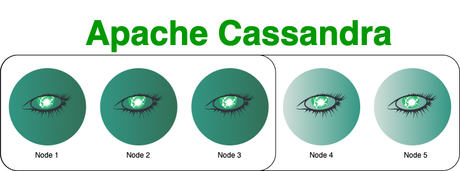

# Linode Marketplace Apache Cassandra Cluster



Create a highly available Apache Cassandra cluster using through the Linode Marketplace. Apache Cassandra is an open-source, distributed NoSQL database management system designed for handling large amounts of data across many commodity servers, providing high availability with no single point of failure. Cassandra offers robust support for clusters with asynchronous masterless replication allowing low-latency operations for all clients. 

## Apache Cassandra Version
- 4.1

**Supported Distributions:**
- Ubuntu 22.04 LTS

## Documentation

Deployment guide:
- [Deploying a Apache Cassandra cluster throught the Linode Marketplace](https://www.linode.com/docs/products/tools/marketplace/guides/cassandra-cluster/)

Additonal resources:

- [Apache Cassandra](https://cassandra.apache.org/doc/stable/index.html)

## Configure Clients With SSL Certificates

This playbook generates the the client servers and stores them on the first node in the cluster (cassandra1), you will need to copy them over to your clients in order to connect your clients to your cluster. First, you will want to copy over the client certificate and key along with the root CA certificate to your client server. Once you login to the cassandra 1 node, the certificates can be found in the `/etc/cassandra/ssl` directory. Once you locate the certificates you can rsync them over to your client server. (Be sure to replace $CLIENTIP with the ip address of your client server)
```
rsync -avp client1.key client1.crt rootCA.crt root@$CLIENTIP:/etc/cassandra/ssl
```

Next, you'll want to configure your cqlshrc file to connect your client to your cassandra cluster. By default, the file is located in user’s home directory at ~/.cassandra/cqlsh, but a custom location can be specified with the --cqlshrc option. You can review the configuration options found in the link below:

https://github.com/apache/cassandra/blob/trunk/conf/cqlshrc.sample

A basic example to get started can look as follows:

```
[connection]
ssl = true
factory = cqlshlib.ssl.ssl_transport_factory
[ssl]
certfile= /etc/cassandra/ssl/rootCA.crt
userkey = /etc/cassandra/ssl/client1_key.key
usercert = /etc/cassandra/ssl/client1_cert.crt
validate = true

```
Next, ensure that you update your `/etc/hosts` so you have host resolution. For example:

```
192.168.139.160 cassandra1
192.168.201.13 cassandra2
192.168.230.83 cassandra3
```

From here you can test connection by logging into your cassandra1 from your client server. (Replace $DB-USER with the Cassandra Database user entered before the deployment)

```
cqlsh cassandra1 -u $DB-USER -p --ssl
```

You can repeat this process for the remainder of the client nodes.
