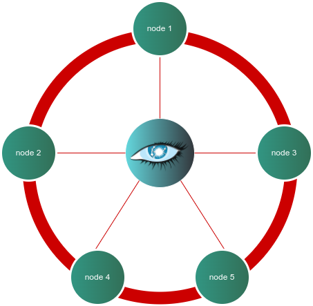

# Linode Marketplace Apache Cassandra Cluster



Create a highly available Apache Cassandra cluster using through the Linode Marketplace. Apache Cassandra is an open-source, distributed NoSQL database management system designed for handling large amounts of data across many commodity servers, providing high availability with no single point of failure. Cassandra offers robust support for clusters with asynchronous masterless replication allowing low-latency operations for all clients. 

## Apache Cassandra Version
- 4.1.5

**Supported Distributions:**
- Ubuntu 22.04 LTS

## Documentation

Deployment guide:
- [Deploying a Apache Cassandra cluster throught the Linode Marketplace](https://www.linode.com/docs/products/tools/marketplace/guides/cassandra-cluster/)

Additonal resources:

- [Apache Cassandra](https://cassandra.apache.org/doc/stable/index.html)

## About The Playbook

This playbook creates a 3-5 node cluster using Apache Cassandra. Authentication to the cluster is secured via a user-supplied username. The default `cassandra` database role is dropped and superseded by the new user role provided by the client. In addition, cluster communication is secured via SSL/TLS where keystores are created and used by the cluster.

Both certificates and keystores can be found on every node in the `/etc/cassandra/ssl` directory. Only the first Cassandra server will have client certificates. This playbook also creates *_n_* amount of client certificates so that applications can connect to the Cassandra cluster.

## Configure Clients With SSL Certificates

We can connect to Cassandra using `cqlsh` using client or server certificates. You will need 4 components in order to connect to the cluster:

- Username and password created by the playbook. You can find the credentials in '/home/admin/.credentials'. Assumming that you created a user called `admin'.
- Client certificate
- Client key
- CA certificate

To start, on the client node, create the following directory, `/home/admin/cassandra_ssl`.  In this example we are assuming that there is a system user called `admin`. 

Next, on the first Cassandra node, copy the content of `/etc/cassandra/ssl/cert/client1.crt`, `/etc/cassandra/ssl/cert/client1.crt` and `/etc/cassandra/ssl/ca/ca.crt` and place it in the `/home/admin/cassandra_ssl` we just created.

We will need to create a Cassandra resource file to use our client certificate. Create the the `/home/admin/.cassandra` directory. Create a file with the following contents:
```
[connection]
ssl = true
factory = cqlshlib.ssl.ssl_transport_factory
[ssl]
certfile = /home/admin/cassandra_ssl/ca.crt
userkey = /home/admin/cassandra_ssl/client1.key
usercert = /home/admin/cassandra_ssl/client1.crt
validate = true
```

Lastly, we connect to one of the Cassandra servers using `cqlsh`:

```
cqlsh 192.168.139.160 -u superuser --ssl
```

Please replace `192.168.139.160` with the private IP address of one of the Cassandra nodes and `superuser` with the user you provided at the start of the cluster. Once you are connected and enter the password at prompt, you have authenticated to the cluster!

```
Connected to Cassandra Cluster at 192.168.139.160:9042
[cqlsh 6.1.0 | Cassandra 4.1.5 | CQL spec 3.4.6 | Native protocol v5]
Use HELP for help.
superadmin@cqlsh>
```

You can distribute the remainder of client certifcates to the remainder of the nodes. Enjoy!

## Cassandra Resources
- [Getting Started with Cassandra](https://cassandra.apache.org/doc/latest/cassandra/getting-started/index.html)
- [Querying Cassandra](https://cassandra.apache.org/doc/latest/cassandra/getting-started/querying.html)
- [CQLSH](https://cassandra.apache.org/doc/stable/cassandra/tools/cqlsh.html)
